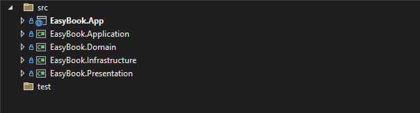
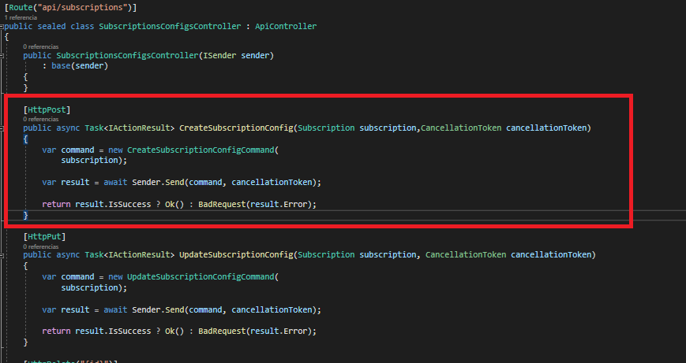
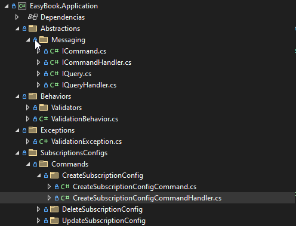
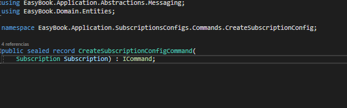
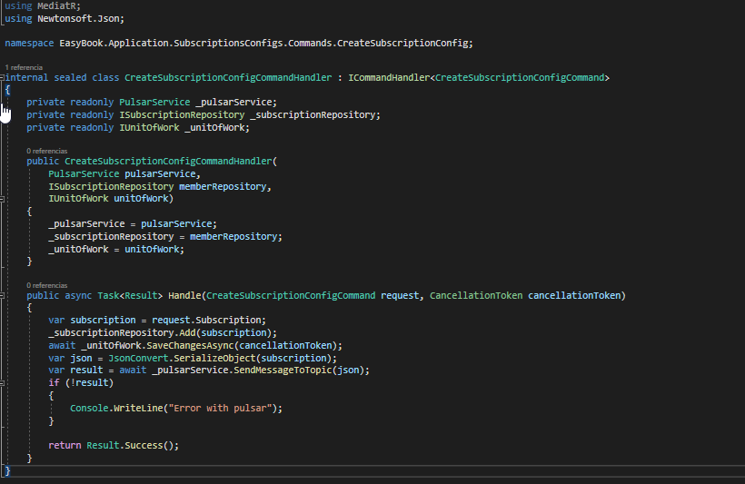
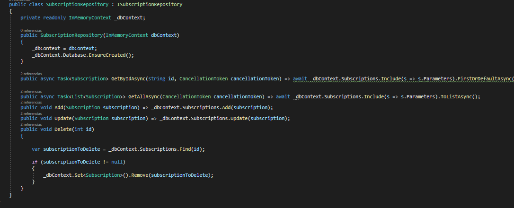
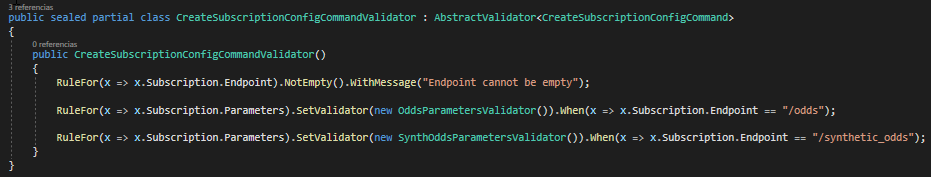

<a name="readme-top"></a>


<!-- PROJECT LOGO -->
<br />
<div align="center">

<h3 align="center">EasyBook API</h3>

  <p align="center">
    API in charge of saving configurations for new subscriptions with TXODDS Fusion
  </p>
</div>

<!-- ABOUT THE PROJECT -->
## About The Project


The API was developed as a RESTful solution that facilitates CRUD operations on configurations to generate subscriptions for "TxOdds Fusion". 
This API expects to be consumed from a frontend where the trader can create, edit or delete configurations.

Two operations are carried out:

* Save to DB (currently in memory)
* Push to "Pulsar" (currently local broker)

<p align="right">(<a href="#readme-top">back to top</a>)</p>


### Built With

* .NET 7 - https://dotnet.microsoft.com/es-es/
* CQRS - https://learn.microsoft.com/es-es/azure/architecture/patterns/cqrs
* MediaTR - https://github.com/jbogard/MediatR
* DotPulsar - https://pulsar.apache.org/docs/3.1.x/client-libraries-dotnet/
* Clean Architecture 




<p align="right">(<a href="#readme-top">back to top</a>)</p>


<!-- GETTING STARTED -->
## Getting Started

Since it is an API, starting it does not have much complexity, integration with docker has not yet been done.

### Prerequisites

This is an example of how to list things you need to use the software and how to install them.

* NET SDK 7.0

  [https://dotnet.microsoft.com/es-es/download/dotnet/7.0](https://dotnet.microsoft.com/es-es/download/dotnet/7.0)

* Pulsar (Currently using pulsar locally)

  [ https://pulsar.apache.org/docs/3.1.x/getting-started-docker/]( https://pulsar.apache.org/docs/3.1.x/getting-started-docker/)


### Installation

1. Clone the repo
   ```sh
   git clone https://bitbucket.itspty.com/scm/spdemo/poc-txodds-fusion-easybook.git
   ```
2. Run Pulsar
   ```sh
   docker run -it -p 6650:6650 -p 8080:8080 --mount source=pulsardata,target=/pulsar/data --mount source=pulsarconf,target=/pulsar/conf apachepulsar/pulsar:3.1.3 bin/pulsar standalone
   ```
3. Run EasyBook.App

<p align="right">(<a href="#readme-top">back to top</a>)</p>


<!-- USAGE EXAMPLES -->
## Usage

### Adding new endpoint with use cases 

1. Add the controller with the corresponding methods in the Presentation project.



2. Create the command (insert, update, delete) or the query (get by id, get all) as appropriate, and the respective handler for the use case in the application layer, the handler must respect the interface provided by mediaTr







3.If business logic is needed, entities, validations, services, etc. can be added to the Domain project.

4. Create the corresponding repository in Infrastructure project, adding the relevant methods.



 

### Adding validations with fluent validation

1. A validator must be created in the application project, which inherits abstract validator, this will be automatically injected through a behavior pipeline. And the respective validations will be executed at the application level as soon as a request arrives under that command or query.



### Adding custom errors


### Adding new configs

<!-- ROADMAP -->
## Roadmap

- [X] Implement CQRS
- [x] Using pulsar locally
- [ ] Implement unit and integration testing
- [ ] Dockerize
- [ ] Remove inmemory and use a db


<p align="right">(<a href="#readme-top">back to top</a>)</p>


<!-- CONTRIBUTING -->
## Contributing


1. Create REL branch from main
2. Create your Feature Branch from REL branch
3. Commit your Changes
4. Push to the Branch
5. Open a Pull Request to REL branch
6. Release REL branch
7. Few days later merge REL -> main

<p align="right">(<a href="#readme-top">back to top</a>)</p>


<!-- CONTACT -->
## Contact

sports.connectors.team@ptytechnologies.com

Franco - franco@ptytechnologies.com

<p align="right">(<a href="#readme-top">back to top</a>)</p>


<!-- ACKNOWLEDGMENTS -->
## Acknowledgments

* []()
* []()
* []()

<p align="right">(<a href="#readme-top">back to top</a>)</p>

